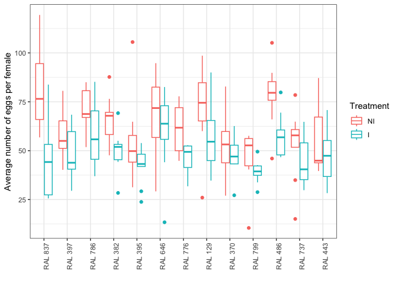
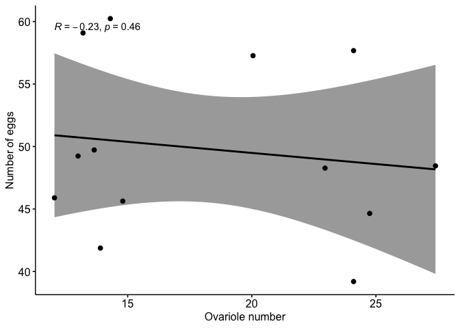
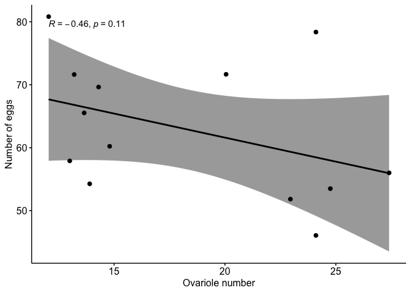
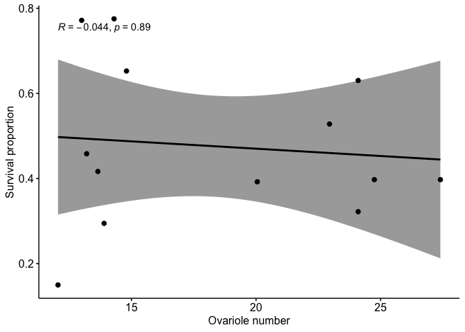
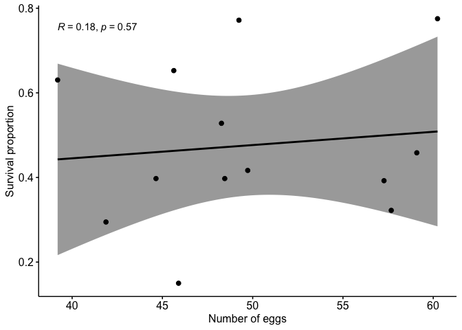
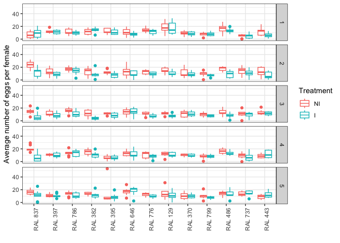
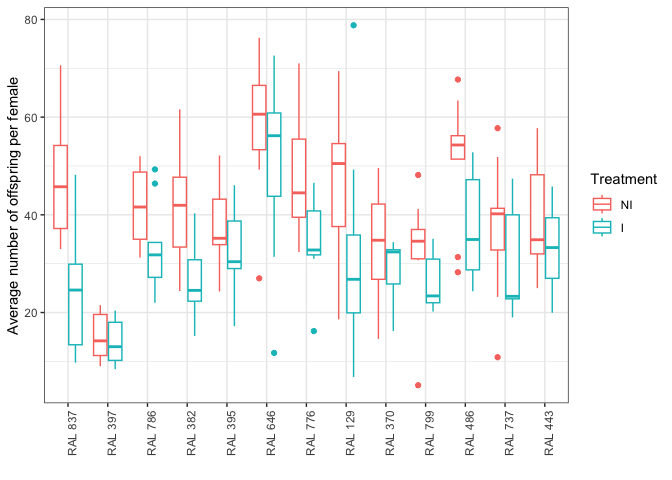
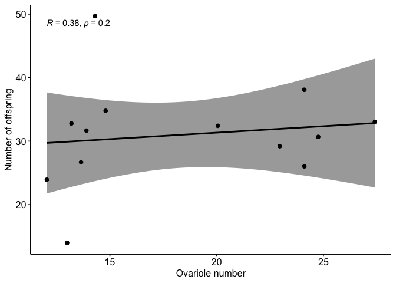
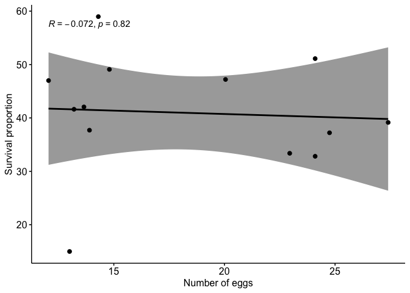

Egg offspring count data analysis
================
Kiran Adhikari
7/3/2025

#### Load required packages

``` r
library(ggplot2)
library(dplyr)
library(tidyverse)
library(ggpubr)
library(lme4)
library(emmeans)
```

#### Read data and calculate the eggs and offspring per female per tube per day

``` r
setwd("~/Documents/Data/Ovariole_number/")
Data<- read.csv("Egg_offspring_count_data.csv", header=TRUE)
Data<- Data %>% mutate(across(c('Block','Day', 'Genotype', 'Treatment', 'Tube'), as.factor))
colnames(Data)[6]<- "Number_of_females"
colnames(Data)[7]<- "Number_of_eggs"
colnames(Data)[8]<- "Number_of_offspring"
Data$Eggs_per_female<- Data$Number_of_eggs/Data$Number_of_females
Data$Offspring_per_female<- Data$Number_of_offspring/Data$Number_of_females
```

#### Check if any columns have NA values

``` r
apply(Data, 2, function(x) any(is.nan(x)))
```

    ##                Block                  Day             Genotype 
    ##                FALSE                FALSE                FALSE 
    ##            Treatment                 Tube    Number_of_females 
    ##                FALSE                FALSE                FALSE 
    ##       Number_of_eggs  Number_of_offspring      Eggs_per_female 
    ##                FALSE                FALSE                FALSE 
    ## Offspring_per_female 
    ##                FALSE

#### Calculate average number of eggs and offsprings per female for each tube across all 5 days

``` r
Data_updated<- Data %>% group_by(Genotype, Treatment, Tube, Block) %>% 
        mutate(Total_eggs = sum(Eggs_per_female), Total_offspring = sum(Offspring_per_female)) %>% distinct(Genotype, Treatment, Tube, Total_eggs, Total_offspring)
```

### Egg data

#### First arrange the genotypes according to their ovariole number and plot the egg numbers

``` r
library(ggplot2)
level_order<- c('RAL 837', 'RAL 397', 'RAL 786', 'RAL 382', 'RAL 395',  'RAL 646', 'RAL 776', 'RAL 129', 'RAL 370', 'RAL 799', 'RAL 486', 'RAL 737',  'RAL 443')

Data_updated$Treatment<- factor(Data_updated$Treatment, levels = c('NI', 'I'))

ggplot(Data_updated, aes(x=factor(Genotype, level=level_order), y = Total_eggs, color= Treatment)) + geom_boxplot() +labs (x= "", y= "Average number of eggs per female") + theme_bw() + theme(axis.text.x = element_text(angle = 90))
```

<!-- -->

#### Test for difference in egg production between treatments within genotypes

``` r
model <- lmer(Total_eggs ~ Genotype * Treatment + (1|Block), Data_updated)
```

#### Calculating Estimated marginal (EM) means for Treatment within Genotype

``` r
emm <- emmeans(model, ~ Treatment | Genotype)
```

#### Pairwise comparisons of treatments within each genotype

``` r
pairs(emm)
```

    ## Genotype = RAL 129:
    ##  contrast estimate   SE  df t.ratio p.value
    ##  NI - I      14.38 6.54 206   2.199  0.0290
    ## 
    ## Genotype = RAL 370:
    ##  contrast estimate   SE  df t.ratio p.value
    ##  NI - I       3.57 6.54 206   0.545  0.5861
    ## 
    ## Genotype = RAL 382:
    ##  contrast estimate   SE  df t.ratio p.value
    ##  NI - I      15.80 6.54 206   2.416  0.0165
    ## 
    ## Genotype = RAL 395:
    ##  contrast estimate   SE  df t.ratio p.value
    ##  NI - I      12.39 6.54 206   1.895  0.0595
    ## 
    ## Genotype = RAL 397:
    ##  contrast estimate   SE  df t.ratio p.value
    ##  NI - I       8.67 6.54 206   1.325  0.1866
    ## 
    ## Genotype = RAL 443:
    ##  contrast estimate   SE  df t.ratio p.value
    ##  NI - I       7.55 6.54 206   1.155  0.2494
    ## 
    ## Genotype = RAL 486:
    ##  contrast estimate   SE  df t.ratio p.value
    ##  NI - I      20.69 6.54 206   3.163  0.0018
    ## 
    ## Genotype = RAL 646:
    ##  contrast estimate   SE  df t.ratio p.value
    ##  NI - I       9.40 6.54 206   1.437  0.1523
    ## 
    ## Genotype = RAL 737:
    ##  contrast estimate   SE  df t.ratio p.value
    ##  NI - I       8.86 6.54 206   1.355  0.1770
    ## 
    ## Genotype = RAL 776:
    ##  contrast estimate   SE  df t.ratio p.value
    ##  NI - I      14.60 6.54 206   2.232  0.0267
    ## 
    ## Genotype = RAL 786:
    ##  contrast estimate   SE  df t.ratio p.value
    ##  NI - I      12.54 6.54 206   1.917  0.0567
    ## 
    ## Genotype = RAL 799:
    ##  contrast estimate   SE  df t.ratio p.value
    ##  NI - I       6.88 6.54 206   1.051  0.2943
    ## 
    ## Genotype = RAL 837:
    ##  contrast estimate   SE  df t.ratio p.value
    ##  NI - I      34.92 6.54 206   5.340  <.0001
    ## 
    ## Degrees-of-freedom method: kenward-roger

#### Generate a dataframe containing a single EM means value per genotype for correlation study

``` r
emm1 <- emmeans(model, ~ Genotype * Treatment)
summary_df <- as.data.frame(emm1)
```

#### Bringing in the survival data for correlation

``` r
Cor<- data.frame(Genotype= c('RAL 837', 'RAL 397', 'RAL 786', 'RAL 382', 'RAL 395',  'RAL 646', 'RAL 776', 'RAL 129', 'RAL 370', 'RAL 799', 'RAL 486', 'RAL 737',  'RAL 443'), Ovariole_number= c(12.05, 13, 13.2, 13.65, 13.9, 14.3, 14.8, 20.05, 22.95, 24.1,24.1, 24.75, 27.4), Survival_proportion= c(0.15, 0.7717391, 0.4583333, 0.4166667, 0.2947368, 0.7752809, 0.6526316, 0.3924051, 0.5280899, 0.6304348, 0.3222222,   0.3974359,0.3974359))
Cor$Genotype<- as.factor(Cor$Genotype)
```

#### Merge two datsets and subset for each treatment condition

``` r
Modified <- merge(Cor, summary_df, by = "Genotype")
Modified_Infected <- subset(Modified, Treatment == "I")
Modified_Uninfected <- subset(Modified, Treatment == "NI")
```

#### Plot correlation between ovariole number and egg production in infected females

``` r
ggscatter(Modified_Infected,  x = "Ovariole_number", y = "emmean",
          add = "reg.line", conf.int = TRUE, 
          cor.coef = TRUE, cor.method = "spearman") + xlab("Ovariole number") + ylab("Number of eggs")
```

<!-- -->

#### Correlation between ovariole number and egg production in uninfected females

``` r
ggscatter(Modified_Uninfected,  x = "Ovariole_number", y = "emmean",
          add = "reg.line", conf.int = TRUE, 
          cor.coef = TRUE, cor.method = "spearman") + xlab("Ovariole number") + ylab("Number of eggs")
```

<!-- -->

#### Correlation between ovariole number and survival in infected females

``` r
ggscatter(Modified_Infected,  x = "Ovariole_number", y = "Survival_proportion",
          add = "reg.line", conf.int = TRUE, 
          cor.coef = TRUE, cor.method = "spearman") + xlab("Ovariole number") + ylab("Survival proportion")
```

<!-- -->

#### Correlation between egg number and survival in infected females

``` r
ggscatter(Modified_Infected,  x = "emmean", y = "Survival_proportion",
          add = "reg.line", conf.int = TRUE, 
          cor.coef = TRUE, cor.method = "spearman") + xlab("Number of eggs") + ylab("Survival proportion")
```

<!-- -->

#### Per day egg production plot

``` r
Data_per_day<- Data %>% group_by(Genotype, Treatment, Day, Tube, Block) %>% 
        mutate(Total = sum(Eggs_per_female)) %>% group_by(Genotype, Treatment, Day, Block) %>% mutate(Mean = mean(Total)) %>% distinct(Genotype, Treatment,Total)

level_order<- c('RAL 837', 'RAL 397', 'RAL 786', 'RAL 382', 'RAL 395',  'RAL 646', 'RAL 776', 'RAL 129', 'RAL 370', 'RAL 799', 'RAL 486', 'RAL 737',  'RAL 443')
Data_per_day$Treatment<- factor(Data_per_day$Treatment, levels = c('NI', 'I'))

ggplot(Data_per_day, aes(x=factor(Genotype, level=level_order), y = Total, color= Treatment)) + geom_boxplot() +labs (x= "", y= "Average number of eggs per female") + theme_bw() +facet_grid(rows = vars(Day)) + theme(axis.text.x = element_text(angle = 90))
```

<!-- -->

### Offspring data

#### Plot offspring number for all genotypes

``` r
ggplot(Data_updated, aes(x=factor(Genotype, level=level_order), y = Total_offspring, color= Treatment)) + geom_boxplot() +labs (x= "", y= "Average number of offspring per female") + theme_bw() + theme(axis.text.x = element_text(angle = 90))
```

<!-- -->

#### Test whether there is difference in offspring number between treatments within genotypes

``` r
model_offspring <- lmer(Total_offspring ~ Genotype * Treatment + (1|Block), Data_updated)
```

#### Calculating EM means for Treatment within Genotype

``` r
emm_offspring <- emmeans(model_offspring, ~ Treatment | Genotype)
```

#### Pairwise comparisons of treatments within each genotype

``` r
pairs(emm_offspring)
```

    ## Genotype = RAL 129:
    ##  contrast estimate   SE  df t.ratio p.value
    ##  NI - I      14.79 5.19 206   2.851  0.0048
    ## 
    ## Genotype = RAL 370:
    ##  contrast estimate   SE  df t.ratio p.value
    ##  NI - I       4.19 5.19 206   0.807  0.4209
    ## 
    ## Genotype = RAL 382:
    ##  contrast estimate   SE  df t.ratio p.value
    ##  NI - I      15.38 5.19 206   2.964  0.0034
    ## 
    ## Genotype = RAL 395:
    ##  contrast estimate   SE  df t.ratio p.value
    ##  NI - I       6.05 5.19 206   1.166  0.2450
    ## 
    ## Genotype = RAL 397:
    ##  contrast estimate   SE  df t.ratio p.value
    ##  NI - I       1.01 5.19 206   0.194  0.8465
    ## 
    ## Genotype = RAL 443:
    ##  contrast estimate   SE  df t.ratio p.value
    ##  NI - I       6.12 5.19 206   1.179  0.2399
    ## 
    ## Genotype = RAL 486:
    ##  contrast estimate   SE  df t.ratio p.value
    ##  NI - I      13.02 5.19 206   2.509  0.0129
    ## 
    ## Genotype = RAL 646:
    ##  contrast estimate   SE  df t.ratio p.value
    ##  NI - I       9.29 5.19 206   1.789  0.0750
    ## 
    ## Genotype = RAL 737:
    ##  contrast estimate   SE  df t.ratio p.value
    ##  NI - I       6.55 5.19 206   1.262  0.2083
    ## 
    ## Genotype = RAL 776:
    ##  contrast estimate   SE  df t.ratio p.value
    ##  NI - I      14.31 5.19 206   2.758  0.0063
    ## 
    ## Genotype = RAL 786:
    ##  contrast estimate   SE  df t.ratio p.value
    ##  NI - I       8.84 5.19 206   1.703  0.0901
    ## 
    ## Genotype = RAL 799:
    ##  contrast estimate   SE  df t.ratio p.value
    ##  NI - I       6.79 5.19 206   1.308  0.1924
    ## 
    ## Genotype = RAL 837:
    ##  contrast estimate   SE  df t.ratio p.value
    ##  NI - I      23.07 5.19 206   4.445  <.0001
    ## 
    ## Degrees-of-freedom method: kenward-roger

#### In order to get single EMl means value for each genotype for correlation study

``` r
emm_offspring1 <- emmeans(model_offspring, ~ Genotype * Treatment)
offspring_summary_df <- as.data.frame(emm_offspring1)
```

#### Merging the data with ovariole number data from above

``` r
Offspring_Modified <- merge(Cor, offspring_summary_df, by = "Genotype")
Offspring_Modified_Infected <- subset(Offspring_Modified, Treatment == "I")
Offspring_Modified_Uninfected <- subset(Offspring_Modified, Treatment == "NI")
```

#### Plot correlation between ovariole number and offspring count in infected females

``` r
ggscatter(Offspring_Modified_Infected,  x = "Ovariole_number", y = "emmean",
          add = "reg.line", conf.int = TRUE, 
          cor.coef = TRUE, cor.method = "spearman") + xlab("Ovariole number") + ylab("Number of offspring")
```

<!-- -->

#### Plot correlation between ovariole number and offspring count in uninfected females

``` r
ggscatter(Offspring_Modified_Uninfected,  x = "Ovariole_number", y = "emmean",
          add = "reg.line", conf.int = TRUE, 
          cor.coef = TRUE, cor.method = "spearman") + xlab("Number of eggs") + ylab("Survival proportion")
```

<!-- -->

``` r
sessionInfo()
```

    ## R version 4.1.1 (2021-08-10)
    ## Platform: x86_64-apple-darwin17.0 (64-bit)
    ## Running under: macOS Big Sur 10.16
    ## 
    ## Matrix products: default
    ## BLAS:   /Library/Frameworks/R.framework/Versions/4.1/Resources/lib/libRblas.0.dylib
    ## LAPACK: /Library/Frameworks/R.framework/Versions/4.1/Resources/lib/libRlapack.dylib
    ## 
    ## locale:
    ## [1] en_US.UTF-8/en_US.UTF-8/en_US.UTF-8/C/en_US.UTF-8/en_US.UTF-8
    ## 
    ## attached base packages:
    ## [1] stats     graphics  grDevices utils     datasets  methods   base     
    ## 
    ## other attached packages:
    ##  [1] emmeans_1.11.0  lme4_1.1-27.1   Matrix_1.5-1    ggpubr_0.6.0   
    ##  [5] lubridate_1.8.0 forcats_1.0.0   stringr_1.5.1   purrr_1.0.1    
    ##  [9] readr_2.0.2     tidyr_1.3.0     tibble_3.2.1    tidyverse_2.0.0
    ## [13] dplyr_1.1.2     ggplot2_3.5.1  
    ## 
    ## loaded via a namespace (and not attached):
    ##  [1] Rcpp_1.0.7         mvtnorm_1.1-3      lattice_0.20-44    zoo_1.8-9         
    ##  [5] digest_0.6.31      R6_2.6.1           backports_1.2.1    evaluate_1.0.3    
    ##  [9] highr_0.11         pillar_1.10.2      rlang_1.1.1        multcomp_1.4-28   
    ## [13] rstudioapi_0.17.1  minqa_1.2.4        car_3.1-3          nloptr_1.2.2.2    
    ## [17] rmarkdown_2.11     labeling_0.4.3     splines_4.1.1      munsell_0.5.1     
    ## [21] broom_1.0.8        compiler_4.1.1     xfun_0.29          pkgconfig_2.0.3   
    ## [25] mgcv_1.8-36        htmltools_0.5.2    tidyselect_1.2.1   codetools_0.2-20  
    ## [29] tzdb_0.3.0         withr_3.0.2        MASS_7.3-54        grid_4.1.1        
    ## [33] nlme_3.1-152       xtable_1.8-4       gtable_0.3.6       lifecycle_1.0.4   
    ## [37] magrittr_2.0.3     scales_1.3.0       estimability_1.5.1 cli_3.6.1         
    ## [41] stringi_1.7.5      carData_3.0-5      farver_2.1.0       ggsignif_0.6.4    
    ## [45] generics_0.1.3     vctrs_0.6.2        boot_1.3-31        sandwich_3.1-1    
    ## [49] Formula_1.2-5      TH.data_1.1-3      tools_4.1.1        glue_1.6.2        
    ## [53] hms_1.1.3          parallel_4.1.1     pbkrtest_0.5.1     abind_1.4-8       
    ## [57] fastmap_1.1.0      survival_3.2-11    yaml_2.2.1         colorspace_2.0-2  
    ## [61] rstatix_0.7.2      knitr_1.36
